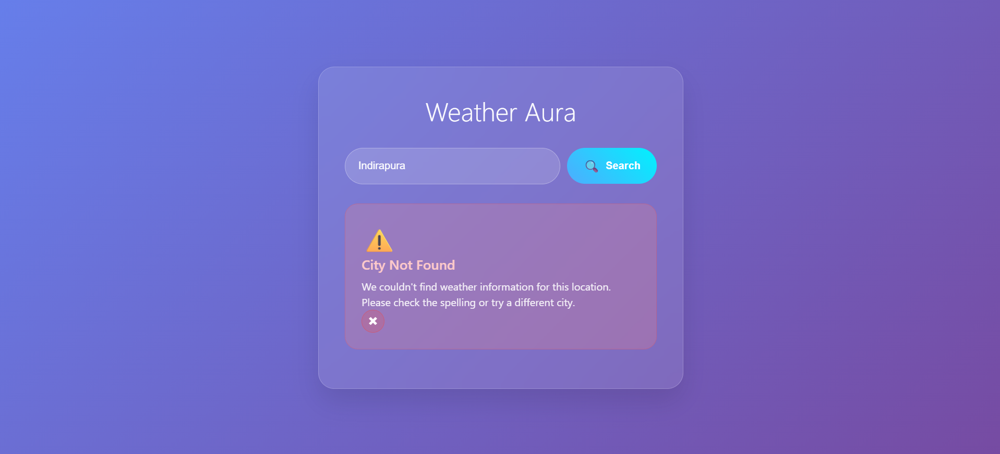

# 🌤️ Weather Aura - Beautiful Weather App

<div align="center">
  
  
  **A stunning glass-morphism weather application built with pure HTML, CSS, and JavaScript**
  
  [](https://developer.mozilla.org/en-US/docs/Web/HTML)
  [](https://developer.mozilla.org/en-US/docs/Web/CSS)
  [](https://developer.mozilla.org/en-US/docs/Web/JavaScript)
  []()
</div>

---

## 🌟 Features

✨ **Beautiful Glass-Morphism Design** - Modern UI with glassmorphism effects and gradient backgrounds  
🎨 **Smooth Animations** - Elegant transitions and hover effects throughout the app  
📱 **Fully Responsive** - Works perfectly on desktop, tablet, and mobile devices  
🔍 **Smart Search** - Intuitive city search with real-time validation  
🌡️ **Comprehensive Weather Data** - Temperature, humidity, wind speed, and more  
⚡ **Loading States** - Beautiful loading animations for better UX  
❌ **Error Handling** - Elegant error messages for invalid city names  
🎯 **Pure Vanilla Code** - No frameworks or libraries, just clean HTML, CSS, and JS

---

## 🖼️ Screenshots & Preview

### Main Interface
<div align="center">
  
</div>

*Clean and intuitive search interface with glass-morphism design*

### Weather Display
<div align="center">
  
</div>

### Eror Display
<div align="center">
  
</div>

*Comprehensive weather information with beautiful card layout*

### Responsive Design
<div align="center">
  
</div>

<div align="center">
  
</div>

*Perfectly responsive across all device sizes*

---

## 🚀 Quick Start

### Prerequisites
- A modern web browser (Chrome, Firefox, Safari, Edge)
- No additional installations required!

### Installation

1. **Clone or Download**
   ```bash
   git clone https://github.com/Thunderer9506/Weather-App.git
   cd weather-app
   ```

2. **Open in Browser**
   ```bash
   # Simply open the HTML file in your browser
   open weather-app.html
   # or double-click the file
   ```

3. **That's it!** 🎉
   No build process, no dependencies, no setup required.

---

## 📁 Project Structure

```
weather-aura/
├── 📄 weather-app.html       # Main HTML file
├── 🎨 weather-styles.css     # All styling and animations
├── 📖 README.md              # Documentation (you're here!)
└── 🖼️ Images/               # Images and media (if any)
```

### File Overview

| File | Purpose | Size |
|------|---------|------|
| `weather-app.html` | Main application structure and JavaScript logic | ~8KB |
| `weather-styles.css` | Complete styling with animations and responsive design | ~12KB |
| `README.md` | Project documentation and guide | ~3KB |

---

## 🎮 How to Use

### Basic Usage

1. **Enter City Name**
   - Type any city name in the search input
   - Examples: "New York", "London", "Tokyo"

2. **Search Weather**
   - Click the "Search" button or press Enter
   - Watch the beautiful loading animation

3. **View Results**
   - See comprehensive weather data
   - Enjoy the smooth animations

### Features in Detail

#### 🔍 **Search Functionality**
- Real-time input validation
- Smart error handling for invalid cities
- Loading states with spinner animation

#### 🌡️ **Weather Data Display**
- Current temperature with large, readable font
- Weather description (Sunny, Cloudy, Rainy, etc.)
- Feels-like temperature
- Humidity percentage
- Wind speed in km/h
- Visibility range

#### ❌ **Error Handling**
- Beautiful error messages for invalid cities
- Closeable error notifications
- Smooth fade-in/out animations

---

## 🎨 Design Features

### Glass-Morphism Effects
- Backdrop blur filters
- Semi-transparent backgrounds
- Elegant border styling
- Layered depth perception

### Animations & Transitions
- **Slide-in animations** for page load
- **Bounce effects** for interactive elements
- **Hover transformations** on buttons and cards
- **Floating animations** for weather icons
- **Pulse effects** for loading states

### Responsive Breakpoints
- **Desktop**: Full feature layout (>768px)
- **Tablet**: Optimized grid layout (480px-768px)
- **Mobile**: Single column layout (<480px)

---

## 🛠️ Technical Details

### Technologies Used
- **HTML5**: Semantic markup and structure
- **CSS3**: Advanced styling with modern features
  - Flexbox & Grid layouts
  - CSS animations & transitions
  - Backdrop filters
  - Custom properties (CSS variables)
- **Vanilla JavaScript**: Pure JS for all interactions
  - Event handling
  - DOM manipulation
  - Mock API simulation

### Browser Compatibility
| Browser | Support |
|---------|---------|
| Chrome | ✅ Full support |
| Firefox | ✅ Full support |
| Safari | ✅ Full support |
| Edge | ✅ Full support |
| IE11 | ❌ Not supported |

### Performance
- **Lightweight**: Total size under 25KB
- **Fast loading**: No external dependencies
- **Smooth animations**: 60fps transitions
- **Optimized CSS**: Efficient selectors and properties

---

## 🎯 Customization

### Color Scheme
The app uses CSS custom properties for easy theming:

```css
:root {
  --primary-gradient: linear-gradient(135deg, #667eea 0%, #764ba2 100%);
  --glass-bg: rgba(255, 255, 255, 0.1);
  --glass-border: rgba(255, 255, 255, 0.2);
  --text-primary: white;
  --text-secondary: rgba(255, 255, 255, 0.8);
}
```

### Adding New Features
The modular structure makes it easy to extend:
- Add new weather parameters in the `showWeatherData()` function
- Customize animations by modifying CSS keyframes
- Extend error handling in the JavaScript section

---

## 🌍 Mock Data

The app currently uses simulated weather data for demonstration:
- Random temperature values (5-35°C)
- Random weather conditions
- Simulated API delay (1.5 seconds)
- Mock error responses for invalid cities

### Invalid Cities (for testing)
- `xyz`, `invalidcity`, `notacity`, `fakecity`
- Any city name shorter than 2 characters

---

## 🤝 Contributing

We welcome contributions! Here's how you can help:

1. **Fork the repository**
2. **Create a feature branch**: `git checkout -b feature-name`
3. **Commit your changes**: `git commit -m 'Add some feature'`
4. **Push to the branch**: `git push origin feature-name`
5. **Submit a pull request**

### Development Guidelines
- Keep the vanilla JavaScript approach
- Maintain responsive design principles
- Follow existing animation patterns
- Test across different browsers
- Update documentation for new features

---

## 🙏 Acknowledgments

- **Design Inspiration**: Modern glass-morphism trends
- **Icons**: Unicode emoji characters for universal compatibility
- **Background Images**: Unsplash for beautiful nature photography
- **Animations**: CSS3 animation best practices

---

## 📞 Contact & Support

- **Issues**: [GitHub Issues](https://github.com/Thunderer9506/Weather-app/issues)
- **Discussions**: [GitHub Discussions](https://github.com/Thunderer9506/Weather-app/discussions)
- **LinkedIn**: [Linked In Profile](https://www.linkedin.com/in/shaurya-srivastava001/)

---

<div align="center">
  <h3>⭐ Star this repository if you found it helpful!</h3>
  <p>Built with ❤️ using pure HTML, CSS, and JavaScript</p>
  
  
</div>
